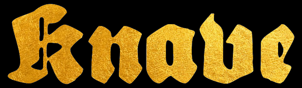
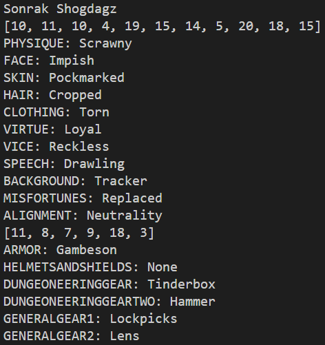
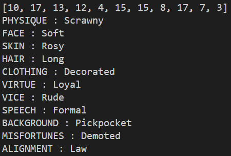
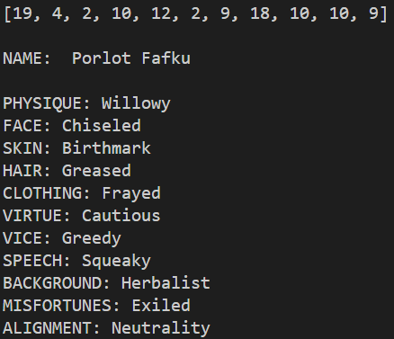
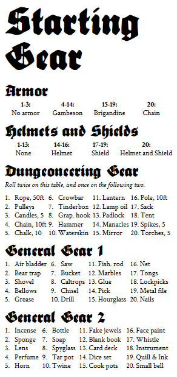

# Knave Character Creator


[Knave rules toolkit on drivethrurpg.com](https://www.drivethrurpg.com/product/250888/Knave)

## Project Overview

A web app to quickly roll a new character for the tabletop role-playing game ruleset Knave.

 - Roll 11 d20s and assign the corresponding character traits
 - Roll 6 d20s for starting gear
 - ~~Random name generator (Courtesy of [Ichabod](https://www.ichabod801.com/))~~ (Currently depricated in browser, follow directions below for Python version)

---

## :warning: Major Update: Web App Now Runs in Browser! :warning:

Simply [visit the github hosted page](https://keith-flynn.github.io/knave-character-creator/) or clone the repository for yourself to run locally. 

### :red_circle: All following instructions are left in place for the original Python script version. :red_circle:

---

## How To Run

Simply run the main.py file. Name generation, rolls, and traits are automatically printed in the terminal.

---

## Resources Used

- Python 3.10
- Pandas 1.4.4

---

## Background Information
[What is a funnel?](https://rpg.stackexchange.com/questions/51227/what-is-a-funnel)

``` A "funnel" is an adventure designed to take in a large number of 1st- or 0th-level characters and spit out just the survivors, if any. The metaphor is the shape of the PC tool: large at the entrance, small at the exit.```

In a funnel adventure you do not start as a level 3 fighter, or even a level 1 wizard. Your character(s) are not even adventurers. You will control several level 0 peasants who are not cut out for adventuring and in all liklihood will perish soon. Your real strength is numbers, as everyone at your table will control their own part of the angry peasant mob.

This rules toolkit has a simple yet vibrant character trait generation system which works well for churning out unique adventurers. The only drawback is the time it takes to roll and reference all of your starting traits, which is automated with this project.

Knave's ruleset synergizes extremely well with [Dungeon Crawl Classic](https://www.drivethrurpg.com/product/101050/dungeon-crawl-classics-rpg-dcc-rpg)


---

## Examples





---



---

## License

[GNU GENERAL PUBLIC LICENSE](LICENSE)